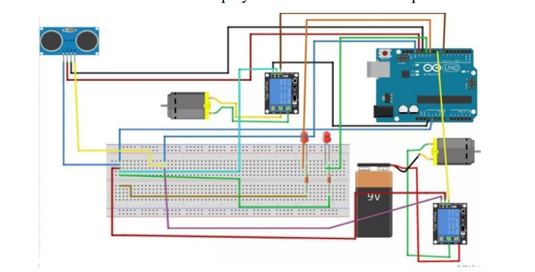

# Smart Irrigation System

This project demonstrates a simple Arduino-based smart irrigation system. It uses various sensors to monitor environmental conditions and control a water pump accordingly. The system includes an LCD display for real-time feedback and utilizes an SD card for data logging.

## Components Used

- **Arduino Board** (e.g., Arduino Uno)
- **DHT11 Sensor** (for humidity and temperature measurement)
- **Soil Moisture Sensor**
- **Rain Sensor**
- **Relay Module** (for controlling the water pump)
- **16x2 LCD Display** with I2C interface
- **SD Card Module** (for data logging)
- **Water Pump** (controlled via relay)

## Libraries Required

1. **hd44780** - For controlling the LCD display
2. **DHT** - For interfacing with the DHT11 sensor
3. **SPI** - For SD card communication
4. **SD** - For SD card data logging
   
## Circuit Diagram

## Circuit Connections

### Moisture Sensor
- **VCC**: Connected to the **5V** pin of the Arduino board.
- **GND**: Connected to the **GND** pin of the Arduino board.
- **Analog Output**: Connected to the **A0** analog input pin of the Arduino board.

### Water Pump
- **Positive Terminal**: Connected to the **Relay Module**.
- **Negative Terminal**: Connected to the **GND** pin of the Arduino board.
- **Relay Module**: Connected to a **digital output pin (Pin 8)** of the Arduino board.

### Rain Sensor
- **VCC**: Connected to the **5V** pin of the Arduino board.
- **GND**: Connected to the **GND** pin of the Arduino board.
- **Analog Output**: Connected to the **A1** analog input pin of the Arduino board.

### LCD Display
- **SDA Pin**: Connected to the **A4** pin of the Arduino board.
- **SCL Pin**: Connected to the **A5** pin of the Arduino board.

### DHT11 Sensor
- **VCC**: Connected to the **5V** pin of the Arduino board.
- **GND**: Connected to the **GND** pin of the Arduino board.
- **Data Pin**: Connected to **digital input/output pin (Pin 9)** of the Arduino board.
  

In addition to the above connections, a power source such as a battery or a power supply should be connected to the Arduino Uno board to power the system. Use jumper wires or a breadboard to make the connections.

Ensure that all connections are made correctly, and the pins are correctly mapped in the code to ensure the system works as intended. Refer to the wiring diagram while making the connections to avoid any errors.
